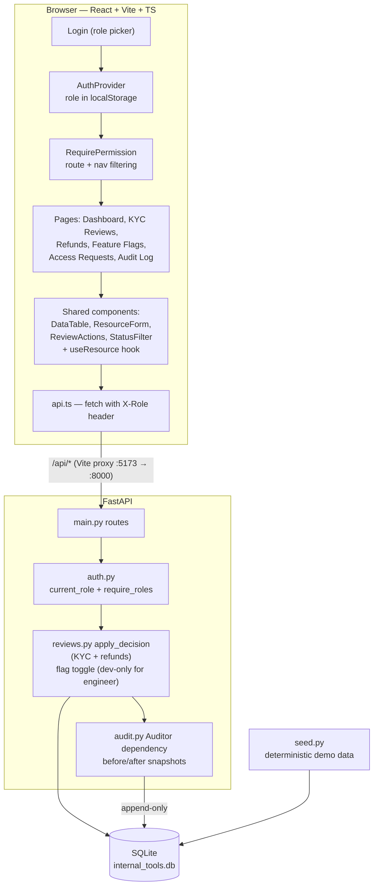

# Internal Tools POC ("Meridian Ops")

A two-hour prototype evaluating whether React + FastAPI can replace Microsoft Power Apps for a
small set of internal fintech applications. It is a demonstration of a *platform pattern*, not a
production system.

## What it demonstrates

- **A reusable platform, not one-off pages.** Five screens (KYC Reviews, Refund Dashboard, Feature
  Flags, Access Requests, Audit Log) are all rendered by the same `DataTable`; the access-request
  form is generated from a zod schema by `ResourceForm`. KYC and refunds also share one
  `ReviewActions` component on the client and one `apply_decision` helper on the server, so a new
  approval queue is a model plus column definitions.
- **Not just approval queues.** Feature Flags is deliberately a different workflow — an inline
  toggle that writes immediately, with no pending state and no reviewer — to show the platform is
  not hard-wired to review-and-approve.
- **Role-based access.** Mock sign-in with Admin / Compliance / Engineer. Permissions drive the
  sidebar, the action buttons, and the API — an Engineer calling `GET /api/kyc-reviews` gets a 403.
- **Audit logging as a first-class feature.** Every mutating endpoint records actor, action, entity,
  and a before/after JSON snapshot through a single FastAPI dependency, so no route can silently
  skip the log — including feature-flag toggles. The log is append-only: there is no update or
  delete endpoint.

## Architecture



Every mutating route depends on `Auditor`, so authorization and audit capture sit on the same path
as the write — a new workflow gets both by construction.

## Running it

Two terminals, no Docker required.

```bash
# backend → http://localhost:8000 (docs at /docs)
cd backend
python3 -m venv .venv && .venv/bin/pip install -r requirements.txt
.venv/bin/uvicorn app.main:app --reload

# frontend → http://localhost:5173 (proxies /api to the backend)
cd frontend
npm install
npm run dev
```

The SQLite database (`backend/internal_tools.db`) is created and seeded with deterministic demo
data on first startup. Delete the file to reset.

## Roles

| Role | Can do |
| --- | --- |
| Admin | Everything: KYC and refund decisions, flag toggles in any environment, access requests |
| Compliance | Decide KYC reviews, read refunds, read the audit log |
| Engineer | Read flags and toggle them in `dev` only; submit access requests and see their own |

Sign-in is a role picker. The chosen role is stored in `localStorage` and sent as an `X-Role`
header; the backend trusts it. **This is not authentication** — it stands in for the SSO
integration a real deployment would use.

## Layout

```
backend/app/
  main.py      routes
  models.py    SQLModel tables (users, kyc_reviews, refunds, feature_flags, access_requests, audit_log)
  auth.py      X-Role mock auth + role guards
  audit.py     Auditor dependency used by every mutating route
  reviews.py   apply_decision, shared by the KYC and refund queues
  seed.py      deterministic demo data
frontend/src/
  components/  DataTable, ResourceForm, ReviewActions, StatusFilter, StatusBadge, PageHeader, AppShell
  hooks/       useResource (list fetch + reload after a mutation)
  auth/        AuthProvider + RequirePermission route guard
  pages/       Login, Dashboard, KycReviews, Refunds, FeatureFlags, AccessRequests, AuditLog
```

## Checks

```bash
cd backend && .venv/bin/python -m pytest    # API + audit + authorization smoke tests
cd frontend && npm run build && npm run lint
```

## Known gaps (deliberate)

Real authentication/authorization, tamper-evident audit storage (hash chaining or WORM), log
retention and export, database migrations, deployment, pagination on the server side,
accessibility and mobile polish, and comprehensive test coverage.
